## [`matplotlib`](https://matplotlib.org/) is the most widely used scientific plotting library in Python.

*   Commonly use a sub-library called [`matplotlib.pyplot`](https://matplotlib.org/api/pyplot_api.html).
*   The Jupyter Notebook will render plots inline if we ask it to using a "magic" command.

~~~
%matplotlib inline
import matplotlib.pyplot as plt
~~~
{: .language-python}

*   Simple plots are then (fairly) simple to create.

~~~
time = [0, 1, 2, 3]
position = [0, 100, 200, 300]

plt.plot(time, position)
plt.xlabel('Time (hr)')
plt.ylabel('Position (km)')
~~~
{: .language-python}

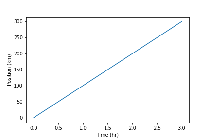
## Plot data directly from a [`Pandas dataframe`](https://pandas.pydata.org/pandas-docs/stable/generated/pandas.DataFrame.html).

*   We can also plot [Pandas dataframes](https://pandas.pydata.org/pandas-docs/stable/generated/pandas.DataFrame.html).
*   This implicitly uses [`matplotlib.pyplot`](https://matplotlib.org/api/pyplot_api.html).
*   Before plotting, we convert the column headings from a `string` to `integer` data type, since they represent numerical values

~~~
import pandas

data = pandas.read_csv('data/gapminder_gdp_oceania.csv', index_col='country')

# Extract year from last 4 characters of each column name
years = data.columns.str.strip('gdpPercap_')
# Convert year values to integers, saving results back to dataframe
data.columns = years.astype(int)

data.loc['Australia'].plot()
~~~
{: .language-python}

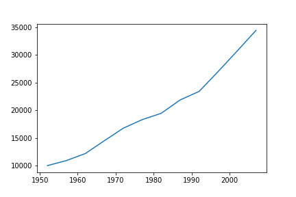
## Select and transform data, then plot it.

*   By default, [`DataFrame.plot`](https://pandas.pydata.org/pandas-docs/stable/generated/pandas.DataFrame.plot.html#pandas.DataFrame.plot) plots with the rows as the X axis.
*   We can transpose the data in order to plot multiple series.

~~~
data.T.plot()
plt.ylabel('GDP per capita')
~~~
{: .language-python}

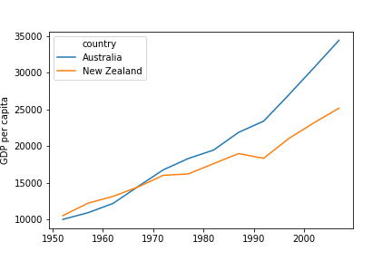
## Many styles of plot are available.

*   For example, do a bar plot using a fancier style.

~~~
plt.style.use('ggplot')
data.T.plot(kind='bar')
plt.ylabel('GDP per capita')
~~~
{: .language-python}

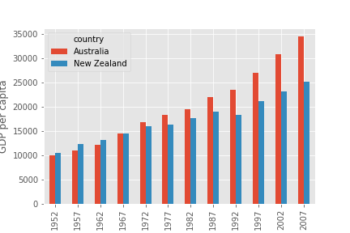

## Data can also be plotted by calling the `matplotlib` `plot` function directly.
*   The command is `plt.plot(x, y)`
*   The color / format of markers can also be specified as an optical argument: e.g. 'b-' is a blue line, 'g--' is a green dashed line.

## Get Australia data from dataframe

~~~
years = data.columns
gdp_australia = data.loc['Australia']

plt.plot(years, gdp_australia, 'g--')
~~~
{: .language-python}

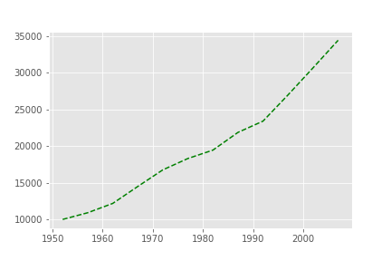

## Can plot many sets of data together.

~~~
# Select two countries' worth of data.
gdp_australia = data.loc['Australia']
gdp_nz = data.loc['New Zealand']

# Plot with differently-colored markers.
plt.plot(years, gdp_australia, 'b-', label='Australia')
plt.plot(years, gdp_nz, 'g-', label='New Zealand')

# Create legend.
plt.legend(loc='upper left')
plt.xlabel('Year')
plt.ylabel('GDP per capita ($)')
~~~
{: .language-python}

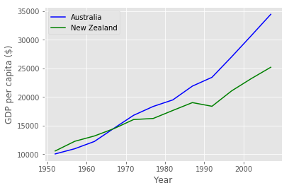
*   Plot a scatter plot correlating the GDP of Australia and New Zealand
*   Use either `plt.scatter` or `DataFrame.plot.scatter`

~~~
plt.scatter(gdp_australia, gdp_nz)
~~~
{: .language-python}

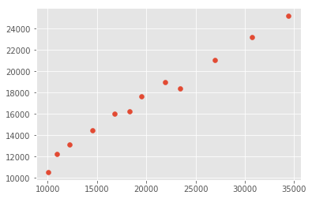
~~~
data.T.plot.scatter(x = 'Australia', y = 'New Zealand')
~~~
{: .language-python}

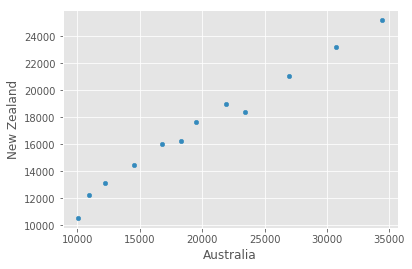
> ## Minima and Maxima
>
> Fill in the blanks below to plot the minimum GDP per capita over time
> for all the countries in Europe.
> Modify it again to plot the maximum GDP per capita over time for Europe.
>
> ~~~
> data_europe = pandas.read_csv('data/gapminder_gdp_europe.csv', index_col='country')
> data_europe.____.plot(label='min')
> data_europe.____
> plt.legend(loc='best')
> plt.xticks(rotation=90)
> ~~~
> {: .language-python}
>
> > ## Solution
> >
> > ~~~
> > data_europe = pandas.read_csv('data/gapminder_gdp_europe.csv', index_col='country')
> > data_europe.min().plot(label='min')
> > data_europe.max().plot(label='max')
> > plt.legend(loc='best')
> > plt.xticks(rotation=90)
> > ~~~
> > {: .language-python}
> > 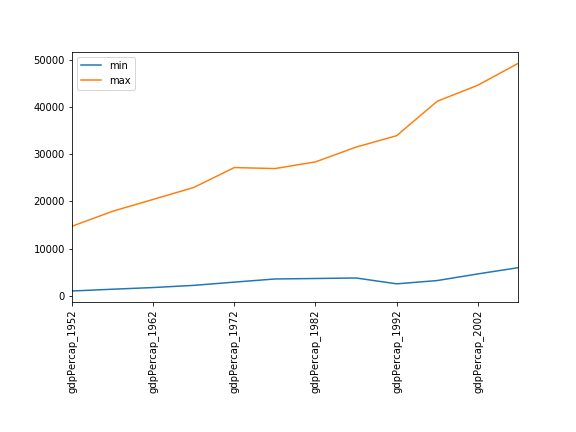
> {: .solution}
{: .challenge}

> ## Correlations
>
> Modify the example in the notes to create a scatter plot showing
> the relationship between the minimum and maximum GDP per capita
> among the countries in Asia for each year in the data set.
> What relationship do you see (if any)?
>
> ~~~
> data_asia = pandas.read_csv('data/gapminder_gdp_asia.csv', index_col='country')
> data_asia.describe().T.plot(kind='scatter', x='min', y='max')
> ~~~
> {: .language-python}
>
> > ## Solution
> >
> > 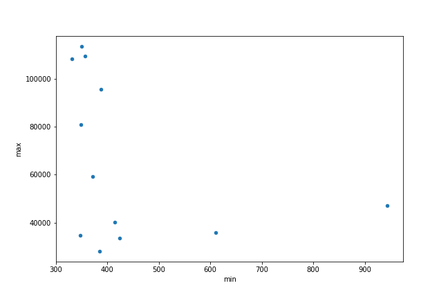
> >
> > No particular correlations can be seen between the minimum and maximum gdp values
> > year on year. It seems the fortunes of asian countries do not rise and fall together.
> >
> {: .solution}
>
> You might note that the variability in the maximum is much higher than
> that of the minimum.  Take a look at the maximum and the max indexes:
>
> ~~~
> data_asia = pandas.read_csv('data/gapminder_gdp_asia.csv', index_col='country')
> data_asia.max().plot()
> print(data_asia.idxmax())
> print(data_asia.idxmin())
> ~~~
> {: .language-python}
> > ## Solution
> > 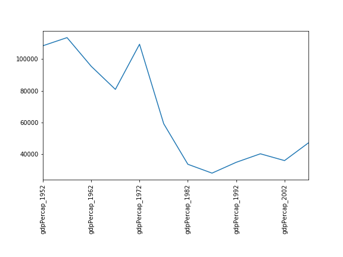
> >
> > Seems the variability in this value is due to a sharp drop after 1972.
> > Some geopolitics at play perhaps? Given the dominance of oil producing countries,
> > maybe the Brent crude index would make an interesting comparison?
> > Whilst Myanmar consistently has the lowest gdp, the highest gdb nation has varied
> > more notably.
> >
> {: .solution}
{: .challenge}

> ## More Correlations
>
> This short program creates a plot showing
> the correlation between GDP and life expectancy for 2007,
> normalizing marker size by population:
>
> ~~~
> data_all = pandas.read_csv('data/gapminder_all.csv', index_col='country')
> data_all.plot(kind='scatter', x='gdpPercap_2007', y='lifeExp_2007',
>               s=data_all['pop_2007']/1e6)
> ~~~
> {: .language-python}
>
> Using online help and other resources,
> explain what each argument to `plot` does.
>
> > ## Solution
> > 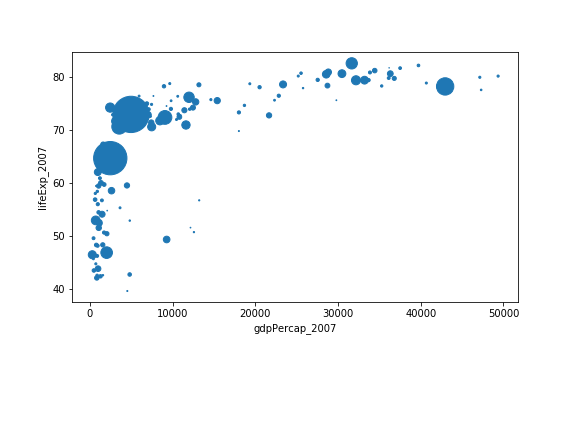
> >
> > A good place to look is the documentation for the plot function -
> > help(data_all.plot).
> >
> > kind - As seen already this determines the kind of plot to be drawn.
> >
> > x and y - A column name or index that determines what data will be
> > placed on the x and y axes of the plot
> >
> > s - Details for this can be found in the documentation of plt.scatter.
> > A single number or one value for each data point. Determines the size
> > of the plotted points.
> >
> {: .solution}
{: .challenge}

> ## Saving your plot to a file
> 
> If you are satisfied with the plot you see you may want to save it to a file,
> perhaps to include it in a publication. There is a function in the
> matplotlib.pyplot module that accomplishes this:
> [savefig](https://matplotlib.org/api/_as_gen/matplotlib.pyplot.savefig.html).
> Calling this function, e.g. with
> ~~~
> plt.savefig('my_figure.png')
> ~~~
> {: .language-python}
> 
> will save the current figure to the file `my_figure.png`. The file format
> will automatically be deduced from the file name extension (other formats
> are pdf, ps, eps and svg).
>
> Note that functions in `plt` refer to a global figure variable
> and after a figure has been displayed to the screen (e.g. with `plt.show`) 
> matplotlib will make this  variable refer to a new empty figure.
> Therefore, make sure you call `plt.savefig` before the plot is displayed to
> the screen, otherwise you may find a file with an empty plot.
>
> When using dataframes, data is often generated and plotted to screen in one line,
> and `plt.savefig` seems not to be a possible approach.
> One possibility to save the figure to file is then to
>
> * save a reference to the current figure in a local variable (with `plt.gcf`) 
> * call the `savefig` class method from that varible.
>
> ~~~
> fig = plt.gcf() # get current figure
> data.plot(kind='bar')
> fig.savefig('my_figure.png')
> ~~~
> {: .language-python}
{: .callout}

